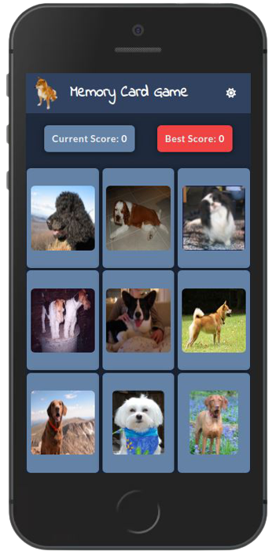
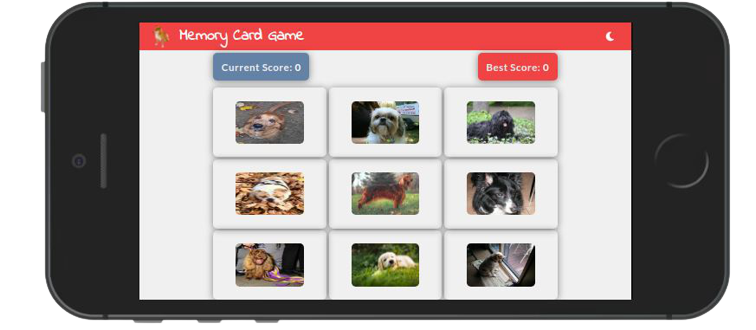

# Memory Card Game

<div style="display: flex">


</div>

<br>
<br>

A React-based, fully responsive memory card game. The **main goal** is to earn points, by clicking on images that have _not_ been clicked before. Each time you do, the images **shuffle**. However, if an image is clicked on twice, you lose.

This project was a lovely chance to practise Redux Toolkit, Styled Components and custom React hooks. It features state-persisting themes and API-fetched dog images. For a detailed overview, please have a look at the [**Features**](##features) & [**Tech**](##tech) section.

## Installation

As this project was bootstrapped with React, the following scripts are available:

**Install** the dependencies:

```
npm install
```

Run the app in **development** mode:

```
npm start
```

Launch the **test server** in the interactive watch mode:

```
npm test
```

## Features

- Gallery-shuffling based on the Fisher-Yates algorithm.
- Notification system for the HTTP request status.
- Fallback UI.
- Dynamic modal dialogues.
- State-persisting themes.
- API-fetched images.
- Fully-responsive in both landscape & portrait mode.

## Tech

- React
- Redux Toolkit
- Styled Components
- FontAwesome

For a more detailed overview of the development & production dependencies, please check `package.json`.

## Live Version

<https://developedbygeo.github.io/Memory-card-game/>

## Contributing

Contributions are certainly welcome. Please feel free to open an issue/PR if there is something you would like to be changed.

## Acknowledgements

A massive thank you to The Odin Project & freeCodeCamp for their guidance and quality material.

## License

[MIT](./LICENSE.md)
